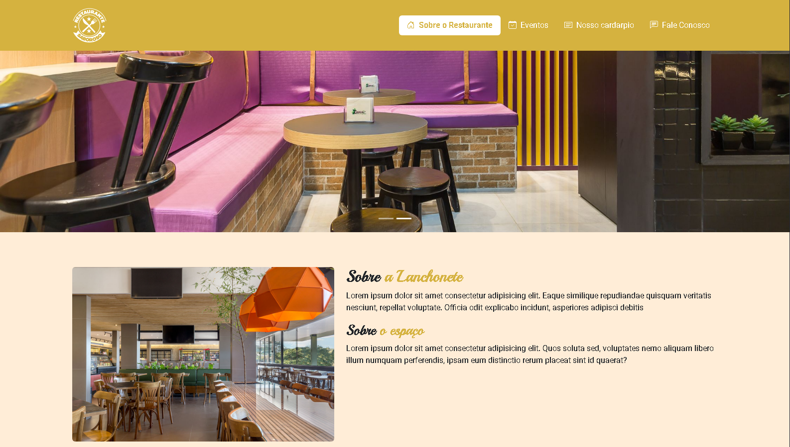
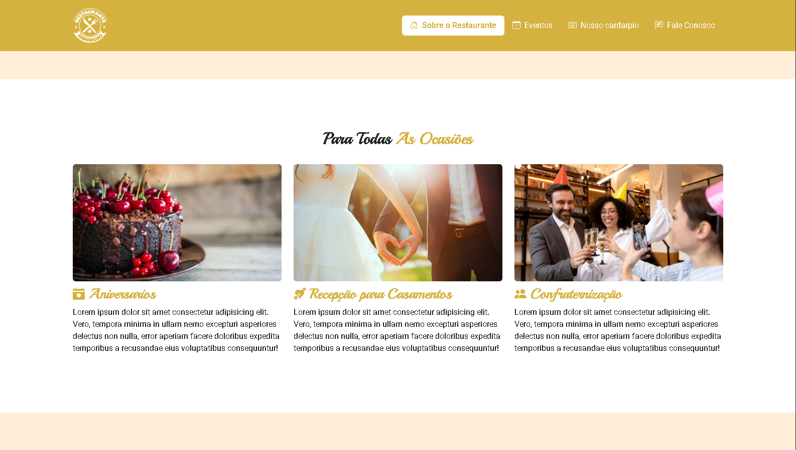
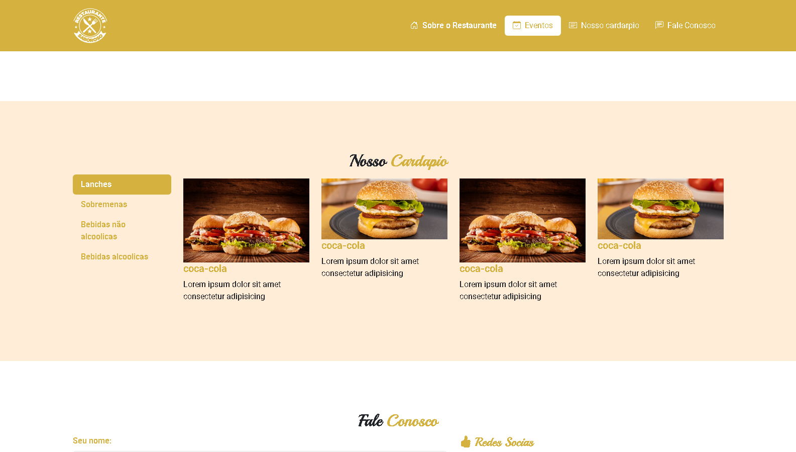
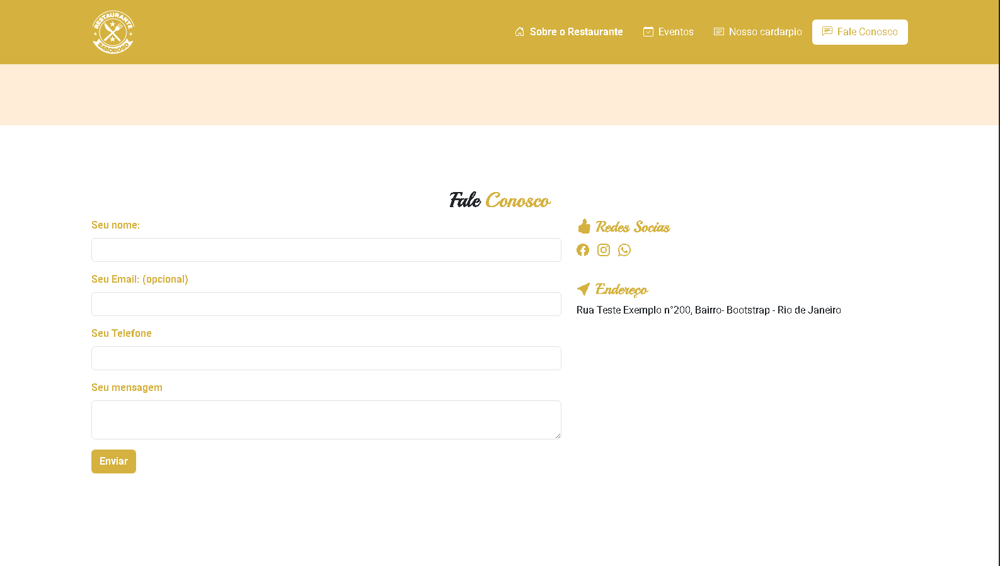

## 🍔 Site Lanchonete - Página Inicial

[🇺🇸 English Version](README.md) | [🇧🇷 Versão em Português](#)

---



Landing page de uma lanchonete fictícia, desenvolvida com **HTML5**, **CSS3** e **JavaScript**, como exercício de estruturação de sites institucionais, prática de front-end básico e interatividade.

## 📋 Índice

- [📌 Sobre o Projeto](#-sobre-o-projeto)
- [🚀 Tecnologias Utilizadas](#-tecnologias-utilizadas)
- [💻 Como Executar](#-como-executar)
- [📷 Imagens e Layout](#-imagens-e-layout)
- [📬 Contato](#-contato)
- [📜 Licença](#-licença)

---

## 📌 Sobre o Projeto

O **Site Lanchonete** é um projeto de site estático que simula a página de uma lanchonete ou hamburgueria. Apresenta um menu fictício, imagens ilustrativas e informações de contato, com foco em design limpo, navegação simples e interatividade por meio de JavaScript.

## 🔹 Recursos principais

✅ Estrutura simples e clara  
✅ Menu fictício com imagens  
✅ Design adaptável  
✅ Interatividade com JavaScript  
✅ Projeto ideal para iniciantes em HTML/CSS/JS

---

## 🚀 Tecnologias Utilizadas

- **HTML5**  
- **CSS3**  
- **JavaScript**

---

## 💻 Como Executar

1️⃣ Clone o repositório:  
```bash
git clone https://github.com/zSayloon/site-lanchonete.git
```

2️⃣ Acesse a pasta do projeto:  
```bash
cd site-lanchonete
```

3️⃣ Abra o arquivo `index.html` no navegador.

> 💡 Dica: Use a extensão Live Server no VSCode para visualizar o site em tempo real.

---

## 📷 Imagens e Layout

Abaixo algumas capturas de tela do site:

>**Sobre a Loja**
<p align="center">
  
</p>

>**Eventos**
<p align="center">
  
</p>

>**Cardápio**
<p align="center">
  
</p>

>**Contato**
<p align="center">
  
</p>

---

## 📬 Contato

📧 **Email:** eduardo.f5@outlook.com  
🔗 **LinkedIn:** [Eduardo Falabriti](https://www.linkedin.com/in/eduardo-falabriti-b-ferreira-537241310/)

---

## 📜 Licença

Este projeto foi desenvolvido com fins educacionais e não possui licença comercial.

---

🍟 **Desenvolvido como prática de HTML, CSS e JavaScript por Eduardo Falabriti**
